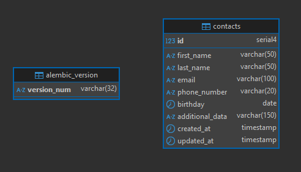

# Зберігання та управління контактами

Мета — створити REST API для зберігання та управління контактами. API повинен бути побудований з використанням інфраструктури FastAPI та повинен використовувати SQLAlchemy для управління базою даних.

Технічний опис завдання

**1. Контакти**

Для зберігання контактів вашої системи необхідно організувати базу даних, яка буде містити всю необхідну інформацію.

Ця інформація повинна включати:

- Ім'я
- Прізвище
- Електронна адреса
- Номер телефону
- День народження
- Додаткові дані (необов'язково)

**2. API**

API, яке ви розробляєте, повинно підтримувати базові операції з даними. Нижче наведено список дій, які ваш API повинен мати можливість виконувати:

- Створити новий контакт
- Отримати список всіх контактів
- Отримати один контакт за ідентифікатором
- Оновити контакт, що існує
- Видалити контакт

**3. CRUD API**

На придачу до базового функціоналу CRUD API також повинен мати наступні функції:

- Контакти повинні бути доступні для пошуку за іменем, прізвищем чи адресою електронної пошти (Query параметри).
- API повинен мати змогу отримати список контактів з днями народження на найближчі 7 днів.

## 1. Створення структури директорій проекту:

```shell
├── src
│   ├── api
│   │   ├── notes.py
│   │   └── tags.py
│   ├── services
│   │   ├── notes.py
│   │   └── tags.py
│   ├── repository
│   │   ├── notes.py
│   │   └── tags.py
│   ├── database
│   │   ├── models.py
│   │   └── db.py
│   ├── conf
│   │   └── config.py
│   └── schemas.py
├── pyproject.toml
└── main.py
```

## 2. Створення підключення до бази даних

[src/conf/config.py](src/conf/config.py) - конфігураційні налаштування проєкту.  
Клас Config містить інформацію для підключення до бази даних. Поки що він визначає змінну DB_URL, яка є рядком підключення до бази даних PostgreSQL.

Для запуску бази даних postgres ми використовуємо Docker:

```shell
docker run --name some-postgres -p 5432:5432 -e POSTGRES_PASSWORD=mysecretpassword -d postgres
```

За допомогою DBeaver створимо БД `hw8` в якій будемо працювати.

[src/database/db.py](src/database/db.py) - модуль налаштування підключення до бази даних.

## 3. Створення моделей

У файлі [src/database/models.py](src/database/models.py) створимо ORM-моделі.

## 4. Міграція моделей за допомогою alembic

### 4.1. Налаштування alembic

Ініціалізуємо оточення `alembic` з підтримкою асинхронності `-t async`

```shell
alembic init -t async alembic
```

Для автоматичної генерації SQL-скриптів у міграціях `alembic`, нам необхідно повідомити про це оточення `alembic` у файлі [alembic/env.py](alembic/env.py)

- імпортуємо нашу декларативну базу `Base` із файлу `models.py`
- імпортуємо рядок підключення `SQLALCHEMY_DATABASE_URL` до нашої бази даних

  Для цього до [alembic/env.py](alembic/env.py) додамо наступний код:

  ```Py
  from src.database.models import Base
  from src.conf.config import config as app_config
  ```

- замінимо рядок

  ```Py
  target_metadata = None
  ```

  на

  ```Py
  target_metadata = Base.metadata
  ```

- та додамо налаштування актуального рядка підключення до БД:

  ```Py
  config.set_main_option("sqlalchemy.url", app_config.DB_URL)
  ```

### 4.2. Створення та застосування міграцій

Створюємо міграцію наступною консольною командою в корені проєкту:

```Shell
alembic revision --autogenerate -m 'Init'
```

Якщо файл з міграцією успішно створився в директорії migrations/versions, то застосуємо створену міграцію:

```shell
alembic upgrade head
```

Переконуємось, що зміни застосовані і в БД створені нові схеми:  


## 5. Схеми валідації

[src/schemas/contacts.py](src/schemas/contacts.py) - Pydantic-моделі для валідації вхідних/вихідних даних.

## 6. Рівень доступу до даних Repository Layer

Усі методи роботи бази даних із контактами ми поміщаємо у файл [src/repository/contacts.py](src/repository/contacts.py).  
Вони виконують безпосередні операції, додавання, зміни та видалення усередині бази даних.

## 7. Рівень бізнес-логіки Service Layer

Директорія [src/services](src/services) - містить бізнес-логіку застосунку й координує роботу між API та репозиторіями.

## 8. Презентаційний рівень API Layer. CRUD-операції

На презентаційному рівні роутери для модуля [src/api/contacts](src/api/contacts.py) містять точки доступу для операцій CRUD для контактів.

## 9. health check - роутер для перевірки стану

У файл [/src/api/utils.py](/src/api/utils.py) помістимо код, який визначає роутер для перевірки стану (health check) нашого FastAPI застосунку. Його можна використовувати в системах оркестрації контейнерів, як Kubernetes, для перевірки готовності застосунку до обробки запитів тощо.

## 10. main.py — точка входу в застосунок

Додаємо реалізацію всіх маршрутів у файл [main.py](main.py) за допомогою механізму роутингу. Це головний файл нашого FastAPI застосунку. Він створює екземпляр FastAPI та підключає різні роутери.

## 11. Запуск

Щоб запустити програму FastAPI для розробки, можна використати `fastapi dev` команду:

```shell
fastapi dev main.py
```

Або, щоб більш гнучко налаштовувати запуск, можна виконати наступну команду, щоб запустити сервер `FastAPI` з `uvicorn`:

```shell
uvicorn main:app --host localhost --port 8000 --reload
```

Тут параметри команди мають наступне значення:

- `uvicorn` — високопродуктивний вебсервер ASGI;
- `main` — файл `main.py`;
- `app` — об'єкт, повернений після запиту `app = FastAPI()`;
- `-host` — дозволяє прив'язати сокет до хоста. Значення за замовчуванням — `127.0.0.1`;
- `-port` — дозволяє прив'язати сокет до певного порту. За замовчуванням використовується значення `8000`;
- `-reload` — забезпечує гаряче перезавантаження сервера під час розробки.
